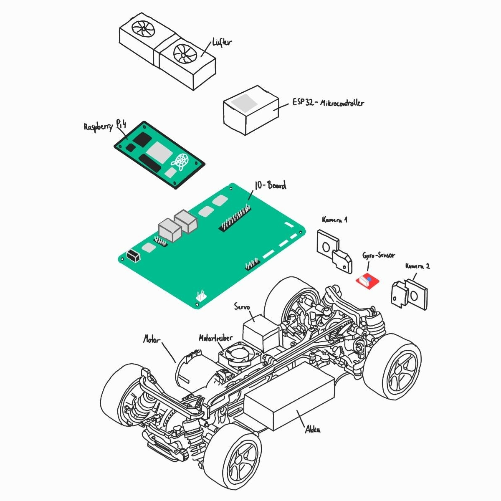
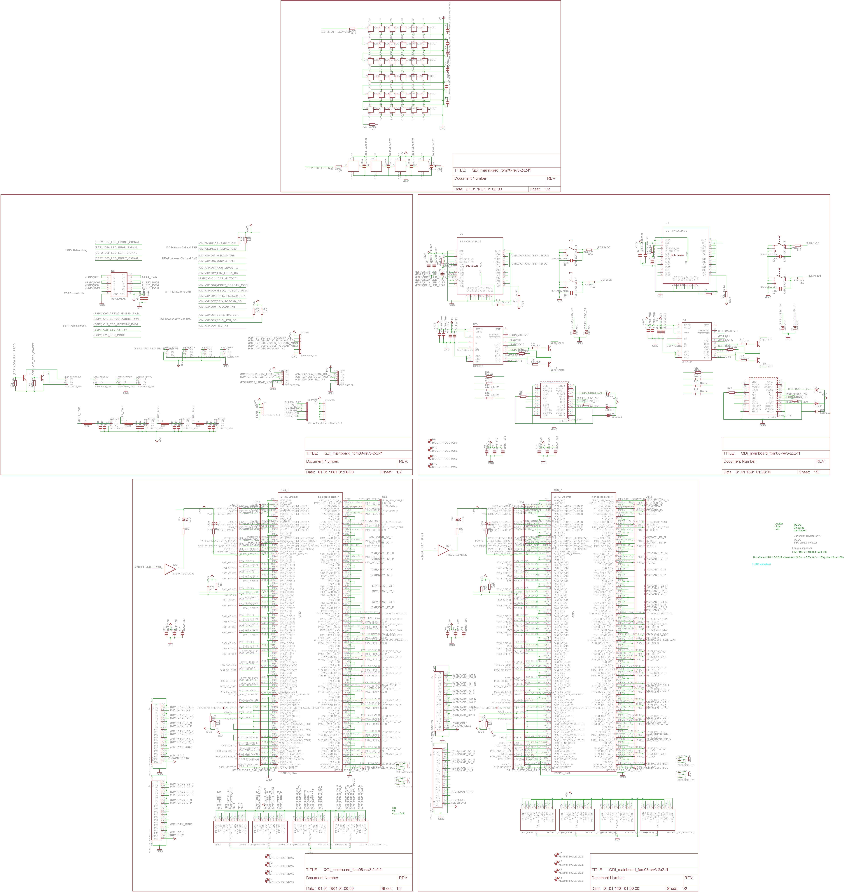
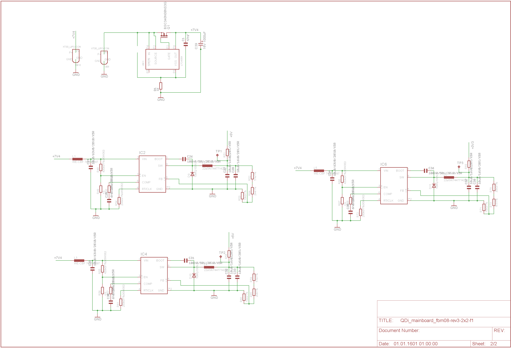
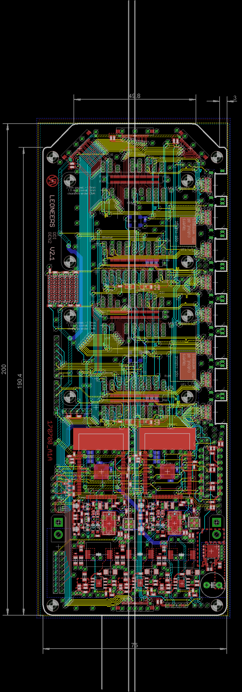

# Technische Zeichnungen

Als Chassis entschieden wir uns dazu ein altes ferngesteuertes Auto zu verweden. Um den Raspberry Pi und die anderen Komponenten mit diesem Chassis verbinden zu können, mussten wir zunächst mit CAD Halterungen erstellen, welche wir anschließend mit unserem 3D-Drucker druckten.

# Schaltpläne für die Hauptplatine

# Layout der Hauptplatine

