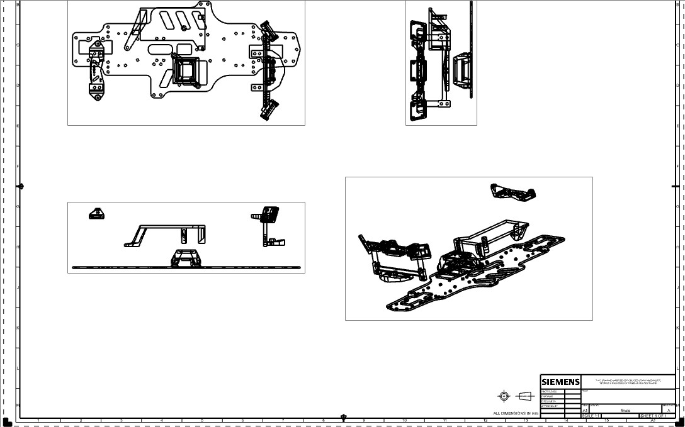

# Technische Zeichnungen

Als Chassis entschieden wir uns dazu ein altes ferngesteuertes Auto zu verweden. Um den Raspberry Pi und die anderen Komponenten mit diesem Chassis verbinden zu können, mussten wir zunächst mit CAD Halterungen erstellen, welche wir anschließend mit unserem 3D-Drucker druckten.

# Schaltpläne für die Hauptplatine
Die Platine für die zweite Genration wurde von uns mit dem Programm EAGLE (Einfach Anzuwendender Grafischer Layout Editor) erstellt. Dazu haben wir zuerst alle gewünschten Komponenten gewählt und einen passenden Schaltplan mit diesen erstellt. Mit diesem Schaltplan kann man anschließend ein Layout der Komponenten erstellen, wie diese später auf der Platine platziert werden sollen. Ziel war es, auf so wenig wie möglich PLatz alle Bauteile zu platzieren. Schlussendlich war es uns möglich mit 4 Lagen und einer Größe von 20cm x 7.5cm alle Komponenten unterzubringen. Damit ist die PLatine nur knapp größer als das Raspberry Pi CM4 IO Board, welches wir in der ersten Generation verwendet haben. Dennoch ist die doppelte Rechenleistung auf dieser, inklusive ESP-23ige und Steckern, untergebracht. Für diese haben wir bei der In der ersten Generation noch eine extra Platine und viele Kabel gebraucht.

Die gesamte Entwicklung und Inbetriebnahme der Platine, sowie die dazugehörigen Aufgaben wurden ohne externe Hilfe in unserem Team durchgeführt. Die Bestückung der SMD-Bauteile wurde freundlicherweise Maschinell bei der PicoLAS-GmbH durchgeführt.
Selbes gilt auch für die Entwicklung des gefrästen Chassis.

# Layout der Hauptplatine

